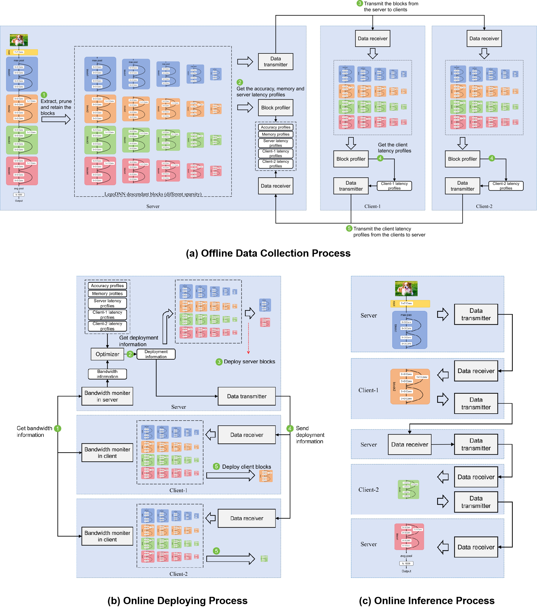
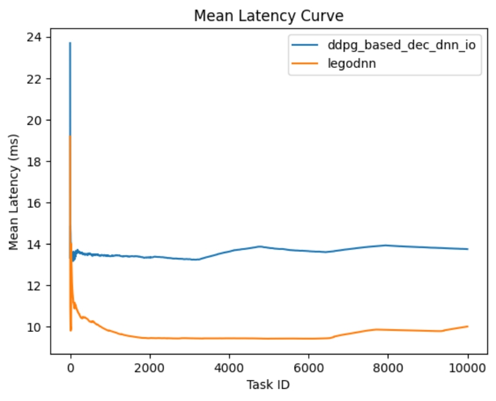
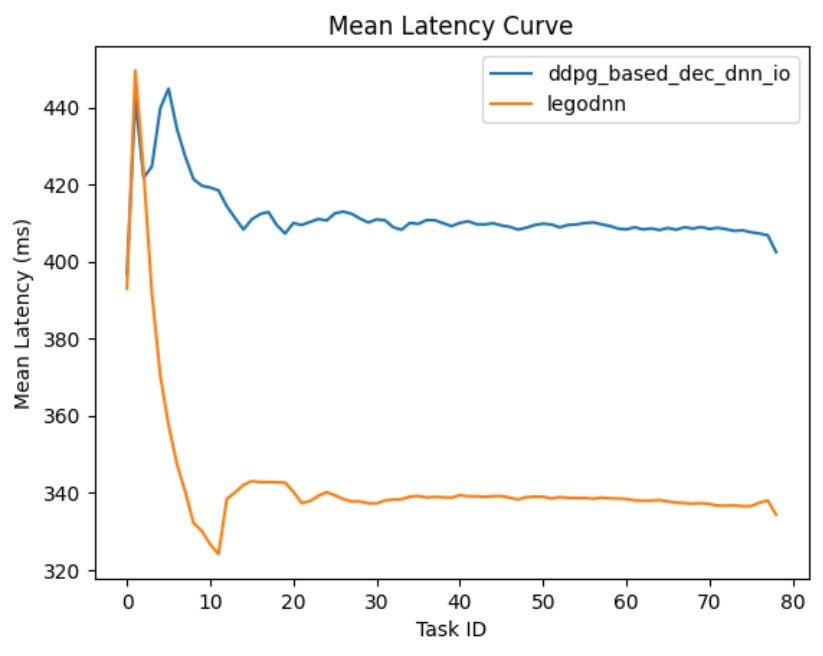

# TaskOffloadingAtEdge

[English]()(待更新) | 简体中文



## Table of contents

- [1 介绍](#1-介绍)

- [2 代码和安装](#2-代码和安装)
  - [2.1 代码](#21-代码)
  - [2.2 安装](#22-安装)
- [3 支持的模型和数据集](#3-支持的模型和数据集)
- [4 实验设置](#4-实验设置)
  - [4.1 实验设备基本配置](#41-实验设备基本配置)
  - [4.2 实验使用的Baseline设置](#42-实验使用的Baseline设置)
  - [4.3 实验模型和推理任务设置](#43-实验模型和推理任务设置)

- [5 实验细节描述](#5-实验细节描述)
  - [5.1 精度相同时的对比实验结果](#51-精度相同时的对比实验结果)
  - [5.2 资源更紧张时的对比实验结果](#52-资源更紧张时的对比实验结果)


## 1 介绍

目前，[LegoDNN](https://github.com/LINC-BIT/legodnn) 通过模型压缩技术，在单设备面临时空资源限制的情况下，实现了推理过程中模型精度的最优化。然而，在某些资源紧张的情况下，单设备方案将难以保证推理效率和精度的最优化。比如对大型模型进行推理时，其推理延迟和参数规模会非常庞大，如果采用 LegoDNN 的单设备部署方案，在资源受限的设备上运行大型模型，将难以保证推理精度的稳定性。为此，我们提出将 LegoDNN 块分布至多个时空资源受限的设备上运行，以减轻单设备的资源压力，并采用高精度方案来进行模型推理，让模型的整体推理效率和精度变得更加稳定。当前，LegoDNN 的卸载方法在与其他 Baseline 方法的对比中，在如下模型上均表现出了良好的效果：

- [ResNet](https://openaccess.thecvf.com/content_cvpr_2016/html/He_Deep_Residual_Learning_CVPR_2016_paper.html) : 在图像分类中，由多个卷积层和池化层进行提取图片信息。但随着网络的深度增加，深度神经网络出现梯度消失(爆炸)问题以及网络退化。对于梯度消失(爆炸)的问题，ResNet添加了BatchNorm层进行约束，而对于网络退化，ResNet则建立了残差网络结果，将每一层的输入添加映射到下一层的输入中。

## 2 代码和安装

### 2.1 代码

以运行图像分类模型为例。

1. 训练图像分类模型

	```shell
	python cv_task/image_classification/cifar/main.py --model [model] --dataset [dataset] --root_path [root_path] --lr [lr] --epoch [epoch] --train_batchsize [train_batchsize] --test_batchsize [test_batchsize] --num_workers [num_workers] --wd [wd]
	```
	
	参数解释：
	
	- `model`: 网络模型，例如：`resnet18`、`mobilenetv2_w1`等
	- `dataset`: 数据集，例如：`cifar10`和`cifar100`
	- `root_path`: 模型保存路径
	- `lr`: 学习率
	- `epoch`: 训练步数
	- `train_batchsize`: 训练时的Batchsize
	- `test_batchsize`: 测试时的Batchsize
	- `num_workers`: 读取数据的线程数
	- `wd`: 训练时L2参数正则化系数

2. 训练 LegoDNN 块（以ResNet18为例）

    ```shell
    python experiments/image_classification/resnet18.py
    ```

3. 运行卸载框架（以ResNet18为例）

    运行服务端：

    ```shell
    python offload/experiments/image_classification/resnet18/resnet18_cloud.py --ip [ip] --port [port] --dataset [dataset] --acc_thres [acc_thres] --compress_layer_max_ratio [compress_layer_max_ratio] --cloud_device [cloud_device]
    ```

    - `ip`: 服务端ip地址
    - `port`: 服务端开启端口
    - `dataset`: 数据集，例如：`cifar10`和`cifar100`
    - `acc_thres`: 精度阈值
    - `compress_layer_max_ratio`: LegoDNN块的压缩率，取决于之前训练LegoDNN块时选择的压缩率
    - `cloud_device`: 服务端使用设备，如`cpu`和`cuda`

	运行客户端：
	```shell
	python offload/experiments/image_classification/resnet18/resnet18_edge.py --ip [ip] --port [port] --dataset [dataset] --compress_layer_max_ratio [compress_layer_max_ratio] --edge_device [edge_device]
	```
	
	 - `ip`: 服务端ip地址
	 - `port`: 服务端开启端口
	 - `dataset`: 数据集，例如：`cifar10`和`cifar100`
	 - `compress_layer_max_ratio`: LegoDNN块的压缩率，取决于之前训练LegoDNN块时选择的压缩率
	 - `edge_device`: 客户端使用设备，如`cpu`和`cuda`


### 2.2 安装

**相关准备**

- Linux and Windows 

- Python 3.8+

- PyTorch 1.9+

- CUDA 11.4+ 

**准备虚拟环境**
1. 准备conda环境并进行激活.
	```shell
	conda create -n Legodnn python=3.8
	conda activate Legodnn
	```
2. 在[官网](https://pytorch.org/)安装对应版本的pytorch
   
   可以在终端直接使用官方提供的code
   **Note:  安装前请确保电脑上是否有显卡且显卡算力和pytorch版本匹配**
3.  安装Legodnn所需要的包
	```shell
	git clone https://github.com/LINC-BIT/TaskOffloadingAtEdge.git
	pip install -r requirements.txt

## 3 支持的模型和数据集

|      | Model Name | Dataset | Task Type |
| :--: | :--------: | :-----: | :-----: |
|  &#9745;   | [ResNet (CVPR'2016)](https://openaccess.thecvf.com/content_cvpr_2016/html/He_Deep_Residual_Learning_CVPR_2016_paper.html) | [Cifar10](http://www.cs.toronto.edu/~kriz/cifar.html)<br />[Cifar100](http://www.cs.toronto.edu/~kriz/cifar.html) | Image Classification |

（后续还会增加）

## 4 实验设置

### 4.1 实验设备基本配置

实验将使用一台服务端设备和两台客户端设备，这些设备均在同一机组中。

1. 服务端设备配置
   - 使用设备：Intel(R) Xeon(R) Silver 4216 CPU @ 2.10GHz 64核心
   - 内存：251G
2. 客户端-1设备配置
   - 使用设备：Intel(R) Xeon(R) CPU E5-2680 v4 @ 2.40GHz 56核心
   - 总内存：251G
3. 客户端-2设备配置
   - 使用设备：Intel(R) Xeon(R) CPU E5-2680 v4 @ 2.40GHz 56核心
   - 总内存：503G

### 4.2 实验使用的Baseline设置

为体现LegoDNN卸载方法的效果，我们选择了一些提前退出类型的模型卸载框架与其相比较。提前退出类型的卸载方法是以[BranchyNet](https://arxiv.org/abs/1709.01686)方法为基础的一类协作推理框架，其能够通过设置提前退出分支的方式来减少模型在设备上运行的时间，并通过训练分支来让分支的精度尽可能提高。可以说，该类方法与本项目所提出方法有着相似的目的。目前采用的Baseline如下所示：

- [DDPG-based DEC-DNN-IO](https://ieeexplore.ieee.org/document/10258387)：该方法是一种基于边缘设备协作推理的DNN推理框架，目的是优化资源受限的物联网（IoVT）设备的推理性能。通过引入 DDPG 强化学习算法，该框架能够智能选择最优的提前退出分支，并确定在该分支所属链中的最佳分割点，从而实现性能与资源利用的平衡优化。
- [DT-assisted Approach](https://ieeexplore.ieee.org/document/10330564)：该论文提出了一种基于数字孪生（DT）的适应性设备-边缘协作DNN推理方法。DT是一种模拟方法，目的是采用代码模拟实际应用中程序的运行，以方便对后续运行情况进行预测。此处使用DT来预测后续卸载过程，并以预测结果选择提前退出分支来进行卸载。

### 4.3 实验模型和推理任务设置

- 实验采取的推理任务： Image Classification
- 实验使用模型：[ResNet](https://openaccess.thecvf.com/content_cvpr_2016/html/He_Deep_Residual_Learning_CVPR_2016_paper.html)
- 实验采用的数据集：
  - [Cifar100](http://www.cs.toronto.edu/~kriz/cifar.html): 共有100个不同类别共计50000个训练样本（每个类有500个）以及10000个测试样本（每个类有100个），其中图像大小为 32×32
- 推理任务生成方式：顺序生成，即前一个任务解决后再生成后一个任务。

## 5 实验细节描述

### 5.1 精度相同时的对比实验结果

#### 5.1.1 实验代码

1. 与DDPG-based DEC-DNN-IO的对比：

	在该实验中，将各推理任务的Batchsize设置为1，将LegoDNN和DDPG-based DEC-DNN-IO的精度限制在77%，比较LegoDNN方法与DDPG-based DEC-DNN-IO方法的推理任务平均延迟。
	
	- **运行LegoDNN**：
	
	  运行服务端：
	
	  ```shell
	  python offload/experiments/image_classification/resnet18/resnet18_cloud.py --ip 127.0.0.1 --port 8000 --dataset cifar100 --acc_thres 0.77 --compress_layer_max_ratio 0.2 --cloud_device cpu
	  ```
	
	  运行客户端：
	
	  ```shell
	  python offload/experiments/image_classification/resnet18/resnet18_edge.py --ip 127.0.0.1 --port 8000 --dataset cifar100 --compress_layer_max_ratio 0.2 --edge_device cpu
	  ```
	
	  **Note:** 服务器和客户端的ip地址请保持一致，127.0.0.1表示在本机上测试。如果有多个设备进行运行的话，则直接在对应的边缘设备上运行相应的代码，同时将其替换为服务器的ip地址。
	
	- **运行DDPG-based DEC-DNN-IO**：
	
	  运行该Baseline前，先将运行目录转移到该Baseline的根目录下。
	
	  训练ResNet18的BranchyNet（请在服务端运行）：
	
	  ```shell
	  python experiments/image_classification/resnet/build_branch_resnet.py
	  ```
	  
	  运行服务端：
	  
	  ```shell
	  python experiments/image_classification/resnet18/resnet18_cloud.py --ip 127.0.0.1 --port 8000 --dataset cifar100 --cloud_device cpu
	  ```
	  
	  运行客户端：
	  
	  ```shell
	  python experiments/image_classification/resnet18/resnet18_edge.py --ip 127.0.0.1 --port 8000 --dataset cifar100 --edge_device cpu
	  ```

#### 5.1.2 实验结果

- **LegoDNN和DDPG-based DEC-DNN-IO的随任务进行的延迟变化曲线如下图所示。**

 

- **LegoDNN和DDPG-based DEC-DNN-IO之间的平均mFLOPs、平均模型大小和平均延迟对比如下表所示。**

|                       | 平均mFLOPs | 平均模型大小(MB) | 平均延迟(ms) |
| :-------------------: | :--------: | :--------------: | :----------: |
|        LegoDNN        |   810.73   |      22.57       |    10.00     |
| DDPG-based DEC-DNN-IO |   980.05   |      29.32       |    13.74     |


#### 5.2 资源更紧张时的对比实验结果

#### 5.2.1 实验代码

1. 与DDPG-based DEC-DNN-IO的对比：

   在该实验中，将各推理任务的Batchsize设置为128，以让设备资源变得更紧张，将LegoDNN和DDPG-based DEC-DNN-IO的精度限制在76.3%，比较LegoDNN方法与DDPG-based DEC-DNN-IO方法的推理任务平均延迟。

   - **运行LegoDNN**：

     运行服务端：

     ```shell
     python offload/experiments/image_classification/resnet18/resnet18_cloud.py --ip 127.0.0.1 --port 8000 --dataset cifar100 --acc_thres 0.763 --compress_layer_max_ratio 0.2 --cloud_device cpu
     ```

     运行客户端：

     ```shell
     python offload/experiments/image_classification/resnet18/resnet18_edge.py --ip 127.0.0.1 --port 8000 --dataset cifar100 --compress_layer_max_ratio 0.2 --edge_device cpu
     ```

     **Note:** 服务器和客户端的ip地址请保持一致，127.0.0.1表示在本机上测试。如果有多个设备进行运行的话，则直接在对应的边缘设备上运行相应的代码，同时将其替换为服务器的ip地址。

   - **运行DDPG-based DEC-DNN-IO**：

     运行该Baseline前，先将运行目录转移到该Baseline的根目录下。

     训练ResNet18的BranchyNet（请在服务端运行）：

     ```shell
     python experiments/image_classification/resnet/build_branch_resnet.py
     ```

     运行服务端：

     ```shell
     python experiments/image_classification/resnet18/resnet18_cloud.py --ip 127.0.0.1 --port 8000 --dataset cifar100 --cloud_device cpu
     ```

     运行客户端：

     ```shell
     python experiments/image_classification/resnet18/resnet18_edge.py --ip 127.0.0.1 --port 8000 --dataset cifar100 --edge_device cpu
     ```

#### 5.2.2 实验结果

- **LegoDNN和DDPG-based DEC-DNN-IO的随任务进行的延迟变化曲线如下图所示。**

 

 

- **LegoDNN和DDPG-based DEC-DNN-IO之间的平均mFLOPs、平均模型大小和平均延迟对比如下表所示。**

|                       | 平均mFLOPs | 平均模型大小(MB) | 平均延迟(ms) |
| :-------------------: | :--------: | :--------------: | :----------: |
|        LegoDNN        |   785.67   |      18.33       |    334.34    |
| DDPG-based DEC-DNN-IO |   900.85   |      21.46       |    402.47    |